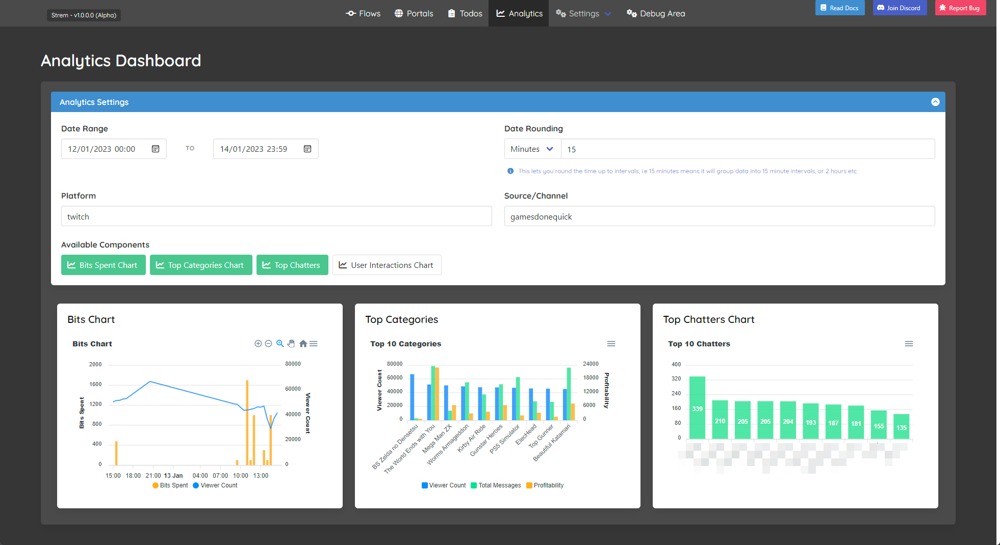
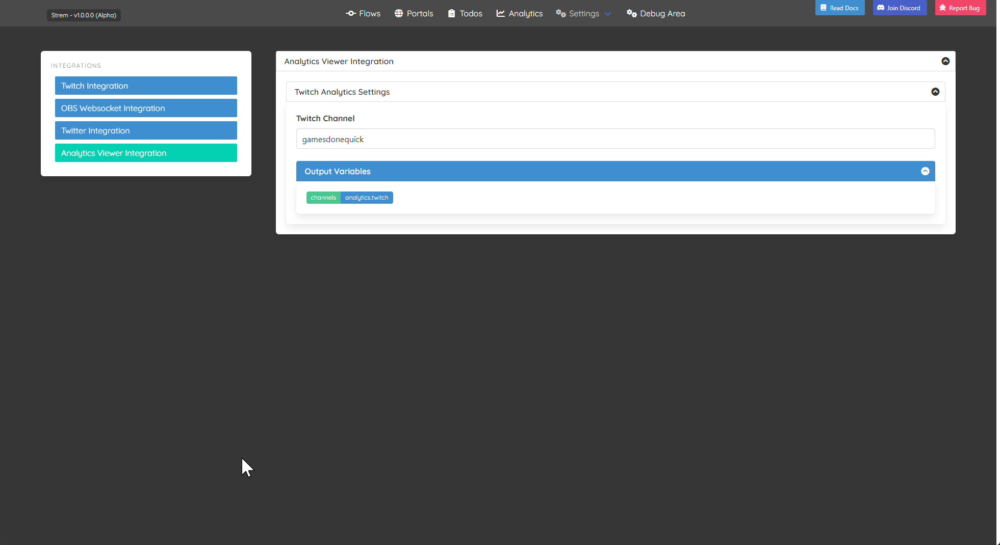

# Strem.Plugins.Analytics

A plugin for generating analytical data around your streams

## Installation

Go to the latest release, download the latest plugin and extract it into your `Plugins` directory.

## How To Use?

### Plugin Setup

When the plugin has been added you should see it being started in your logs, then you will need to setup what channel you want to collect analytics on from the integrations screen:

Once you have setup what channel you want to gather analytics on it will automatically gather information while the application is running, although its worth noting if the application is not running it will be unable to gather analytics metrics.

### Analytics Viewer

Once you are gathering analytics you will have a new `Analytics` option on the main menu which will let you specify the date ranges and other criteria you wish to query on.

> It is worth noting that its expected you will hook this up to your own channel, but as shown in the examples above, you can hook it up to pull in analytics on any channel

## Adding New Charts/Integrations

There are a few packages provided here which are layered a bit like the main `Strem` library, so based off that here is a quick breakdown of the key bits:

### `Strem.Plugins.Analytics`

Out the box you get a core `Strem.Plugins.Analytics` nuget which provides the underlying metrics and infrastructure, which should be used as the basis for the data being stored and grabbed (using `IAnalyticsEventRepository`).

### `Strem.Plugins.Analytics.Viewer`
There is also a `Strem.Plugins.Analytics.Viewer` which is the UI aspect of the plugin which has dependencies for the underlying charts library (`Blazor Apex Charts`) and some other UI related helpers.

If you are writing a plugin that only collects analytics then you only need the base `Strem.Plugins.Analytics` package, if you want to also add custom charts etc then you will need to also pull in this `Strem.Plugins.Analytics.Viewer` plugin.

> For examples on how to add your own charts look at the `Strem.Plugins.Analytics.Twitch` project which contains both custom analytics collection and chart viewing.

## HALP! Something is not working?!

If you have problems drop into the discord (or post issues in here) and hopefully someone can help you out.